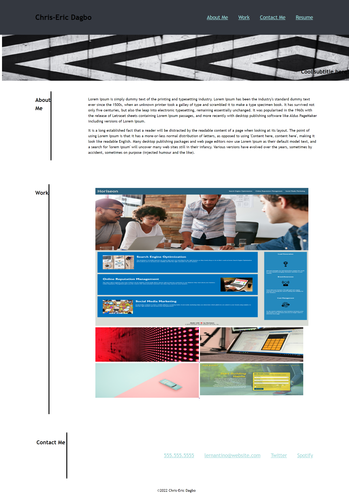

# Portfolio

## Description

Portfolio is a project encompassing a set of work to provide evidence of skills in a given field. It shows a candidate's ability to present a collection of work to get it seen by employers.

## Table of contents
<ul>
    <li>Screenshot</li>
    <li>User Story</li>
    <li>Acceptance Criteria</li>
    <li>Technologies</li>
    <li>Installation</li>
    <li>Usage</li>
    <li>Contributors</li>
    <li>Documentation</li>
    <li>License</li>
    <li>Author</li>

</ul>

## Screenshot

## User Story
As an employer I want to view a potential employee's deployed portfolio setting out his skills. This would enable us to review the collection of work and assess whether the given candidate is suitable for an open position.

## Acceptance Criteria
Here are the critical requirements necessary to develop a portfolio that satisfies a typical hiring manager's needs:
<ul>
    <li>
    When the page is loaded the page presents your name, a recent photo or avatard, and links to sections about you, your work, and how to contact you
    </li>
    <li>
    When one of the links in the navigation is clicked then the UI scrolls to the corresponding section
    </li>
    <li>
    When viewing the section about your work then the section contains titled images of your applications
    </li>
    <li>
    When presented your first application then that application's image should be larger in size than the others
    </li>
    <li>
    When images of the applications are clicked then the user is taken to that deployed application
    </li>
    <li>
    When the page is resized or viewed on various screens and devices then the layout is responsive and adapts to my viewport
    </li>
</ul> 

## Technologies
The current project is set up through the use of the following technologies:
<ul>
    <li>HTML 5</li>
    <li>CSS 3</li>
</ul>

## Installation
The current project does not require any installation. 

## Usage
Please refer to the url of the website.

## Contributors
We discuss some specifics of this challenge with our team members. 
Here are their names:
<ul>
    <li>Adam Sall</li>
    <li>Sam Brooke</li>
    <li>Victor Biscio</li>
    <li>Vittoria Bugana</li>
</ul>

Note that any improvement to this project would be welcome.

## Documentation
In order to build this project, a wide range of websites guide us throughout the process. They helped us consolide our knowledge and dig into CSS Flexbox.
<ul>
    <li>https://www.https://developer.mozilla.org/en-US/</li>
    <li>https://www.w3schools.com/</li>
</ul>

## Licence
Licensed under MIT License. See license file for more information.

Copyright (c) 2022 cedagbo

## Deployment
<ul>
    <li>Website: https://cedagbo.github.io/</li>
    <li>Repositary: https://github.com/cedagbo/portfolio </li> 
</ul>

## Author
@cedagbo
